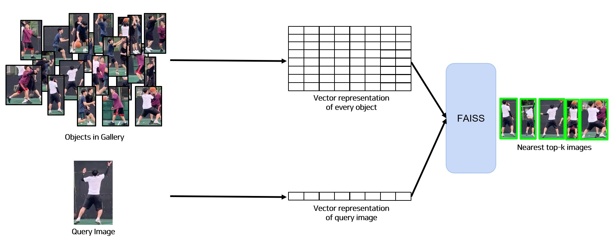
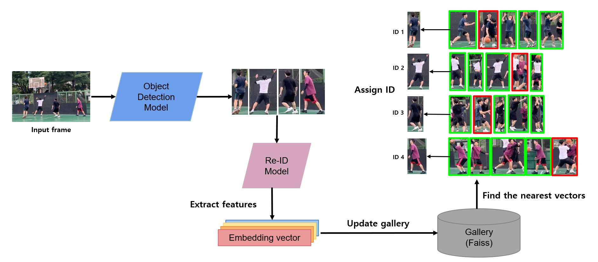

# Basketball Players' Field Goal Percentage Tracker✨
 

*Read this in other languages: [English](README_en.md), [한국어](README.md)*

## 🏀 Background
Have you ever wondered the accuracy of each player's shooting during a game? Attempting to manually record it would be arduous, as you would need to discern which player took each shot, making the task highly laborious. Besides not everyone has a spare time to watch and analyze a full game match. For these reasons, we have created player's FG tracker using deep learning! :) 

<br>

## 🧠 Models
In this project, we utilized two models to achieve our aim. The first model is used to detect players, basketball, ring, shooting attempts, and successful shots made, whereas the second model focused on matching a person's identity across different locations in a video. In essence, we employed Object Detection and Person Re-Identification models to accomplish this project. For our object detection model, we used YOLO-NAS-L, which was trained using super-gradients library made by Deci-AI. As for Person Re-Identification, we opted for MobileNetV3 to ensure faster inference speed and a more compact model size.    

<br>

## Ⓜ️ Faiss
Faiss is a library created by Meta that enables rapid searching of similarity betweeen multiple vector representations. This library was indispensable for our task as it allowed us to accurately determine and match a person's identity. We initially tested with L2 (Euclidean) distance to measure similarity and obtained good results. Nevertheless, upon further experiments, we discovered that utilizing cosine similarity yielded better outputs. Therefore, we have chosen to adopt cosine similarity as our definitive searching method. 

 

<br>

## 🖼️ Object Detection + Person Re-Identification Inference Diagram
This picture below presents an overview of our project's flow using a diagram. When an input frame is received, it undergoes object detection model, which identifies various entities such as players, basketball, ring, shot attempts and successful shots. Among these, we specifially extract instances of the 'player' class and feed them into the Re-ID model. The Re-ID model then produces embedded vectors representing each person's image. These vectors are added to Faiss, allowing us to obtain top 5 IDs corresponding to each embedded vector. Consequently, we leverage hard voting on these results to obtain the final ID with the highest confidence level.

 

<br>

## 📝 Training Configurations & Results
### Object Detection Model
| Models | Dataset[^1] | Input Dimensions | Epochs | Batch Size (Accumulate) | Optimizer | LR | Loss | Augmentations | F1<sup>val<br>0.5 | mAP<sup>val<br>0.5 | 
| --- | --- | --- | --- | --- | --- | --- | --- | --- | --- | --- |
| YOLO NAS-L | D1 | (1920,1088) | 50 | 8 <br> (64)  | AdamW | 0.00001 | PPYOLOE | Resize <br>Normalize <br>HorizontalFlip | 0.2811 | 0.6485 |
| YOLO NAS-L | D2 | (1920,1088) | 215 | 8 <br> (64) | AdamW | 0.0001 | PPYOLOE | HSV <br> Mosaic <br> RandomAffine <br> HorizontalFlip <br> PaddedRescale <br> Standardize <br> | 0.8709 | 0.9407 |
[^1]: Dataset D1 and D2 are our own custom datasets. D2 contains 3.1x more data than D1.

### Person Re-Identification Model
| Models | Dataset[^2] | Embedded Dimensions | Epochs | Batch Size | Optimizer | LR | Loss | Augmentations | mAP<sup>val |
| --- | --- | --- | --- | --- | --- | --- | --- | --- | --- |
| MobileNetV3 | R1 | 1000 | 100 | 64 | AdamW | 0.001 | TripletLoss | Resize <br>Normalize <br>HorizontalFlip | 0.9829 |
| MobileVitV2 | R1 | 1000 | 100 | 64 | AdamW | 0.001 | TripletLoss | Resize <br>Normalize <br>HorizontalFlip | 0.9748 |
| ConvNextV2-A | R1 | 1000 | 100 | 64 | AdamW | 0.001 | TripletLoss | Resize <br>Normalize <br>HorizontalFlip | 0.9721 |
| SqueezeNet | R1 | 1000 | 100 | 64 | AdamW | 0.001 | TripletLoss | Resize <br>Normalize <br>HorizontalFlip | 0.9758 |
| MobileNetV3 | R2 | 1000 | 100 | 64 | AdamW | 0.001 | TripletLoss | Resize <br>Normalize <br>HorizontalFlip | 0.8743 |
| MobileNetV3 | R2 | 1000 | 100 | 64 | AdamW | 0.001 | QuadrupletLoss | Resize <br>Normalize <br>HorizontalFlip | 0.9782 |
| SqueezeNetMod[^3] | R2 | 1000 | 500 | 64 | AdamW | 0.001 | QuadrupletLoss | Resize <br>Normalize <br>HorizontalFlip | 0.9857 |
| MobileNetV3 | R2 | 1000 | 500 | 64 | AdamW | 0.001 | QuadrupletLoss | Resize <br>Normalize <br>HorizontalFlip | 0.9923 |
[^2]: Dataset R1 and R2 are our own custom datasets. R2 contains little bit more data and identities.
[^3]: SqueezeNet + CBAM with reduction ratio of 8.

<br>

## 🛠️ Installation
```py
git clone https://github.com/boostcampaitech5/level3_cv_finalproject-cv-07.git
cd level3_cv_finalproject-cv-07
conda env create --name <env_name> -f env.yaml
```

<br>

## 🗂️ Dataset Path Settings
> Object Detection Path
 
Please ensure that the data is organized in the following configuration:
1. The actual names of the data files do not impact the training process. However, it is essential that the corresponding json files be named as `train.json` and `valid.json`. These specific names are necessary to ensure proper functioning during training.
```
detection
├── data
│   ├── dataset
|   |    ├── train
|   |    |   ├── <sample1>.jpg
|   |    |   ├── <sample2>.jpg
|   |    |   ...
|   |    |   └── <sample10>.jpg
|   |    ├── valid
|   |    |   ├── <sample1>.jpg
|   |    |   ├── <sample2>.jpg
|   |    |   ...
|   |    |   └── <sample10>.jpg
|   |    ├── train.json
|   |    └── valid.json
│   ├── images
│   └── video
...
```

<br>

> Person Re-Identifcation Path

Please ensure that the data is organized in the following configuration:
1. The name of each data entry should be reformatted to a specific format: `xxxxx_xx.jpg` or `xxxxx_xx_xx.jpg`.
2. In this format, the first five numbers represent the ID number of a person and `x` represents any numerical value.
```
re_id
├── data
│   └── custom_dataset
|       ├── gallery
|       |   ├── <00001_01>.jpg
|       |   ├── <00001_02>.jpg
|       |   ├── <00002_01>.jpg
|       |   ├── <00002_02>.jpg
|       |   ...
|       |   └── <00010_2>.jpg
|       ├── query
|       |   ├── <00001_01>.jpg
|       |   ├── <00001_02>.jpg
|       |   ├── <00002_01>.jpg
|       |   ├── <00002_02>.jpg
|       |   ...
|       |   └── <00010_2>.jpg
|       └── training
|           ├── <00001_01>.jpg
|           ├── <00001_02>.jpg
|           ├── <00002_01>.jpg
|           ├── <00002_02>.jpg
|           ...
|           └── <00010_2>.jpg
... 
```

<br>

> Magic Path

Please ensure that the data is organized in the following configuration.  
This is the path where you want to store videos to generate final result, as demonstrated at the beginning of this repository.
```
datasets
├── <video1>.mp4
├── <video2>.mp4
... 
```

<br>

## 👨🏻‍💻 Train & Inference with Just 1 Command Line
### Train Detection Model
---
```
cd detection/tools
python3 train.py --exp_name exp1 --input_dim (1920,1088) --epochs 100 --lr 0.0001 --batch_size 8 --optimizer AdamW --num_workers 4 --warmup_initial_lr 0.00001 --lr_warmup_epochs 5 --score_thr 0.8 --nms_thr 0.8 -- metric F1@0.50 --fp16 True
```
* --exp_name: experiement directory name. It will appear under `model_weights` directory.
* --input_dim: input dimensions
* --epochs: epoch
* --lr: learning rate
* --batch_size: batch_size
* --optimizer: optimizer
* --num_workers: dataloader num workers
* --warmup_initial_lr: warmup initial learning rate
* --lr_warmup_epochs: learning rate warmup epochs
* --score_thr: score threshold
* --nms_thr: non-max suppression threshold
* --metric: evaluation metric
* --fp16: mixed precision training

<br>

### Inference Detection Model
---
```
cd detection/tools
python3 inference.py --image True --video False --file_name image1.png --conf 0.25 --iou 0.35 --model_weight <your_exp_name>/<your_detection_weight>
```
Both `image` and `video` cannot be set into `True` at the same time!
* --image: inference on image
* --video: inference on video
* --file_name: image/video file to be inferenced
* --conf: confidence threshold
* --iou: iou threshold
* --model_weight: model weight file

<br>

### Train Person Re-Identification Model
---
```
cd re_id/tools
python3 train.py --demo False --seed 1 --model mobilenetv3 --epoch 100 --train_batch 64 --valid_batch 256 --lr 0.001 --num_workers 8 --quadruplet True --scheduler False --fp16 False
```
* --demo: `True` uses DeepSportsRadar dataset | `False` uses custom dataset
* --seed: seed number
* --model: model. To use different models, please take a look at `model.py` in models directory.
* --epoch: epoch
* --train_batch: train batch size
* --valid_batch: valid batch size
* --lr: learning rate
* --num_workers: dataloader num workers
* --quadruplet:  `True` uses quadruplet loss | `False` uses triplet loss
* --scheduler: lambda scheduler with 0.95**epoch
* --fp16: mixed precision training

<br>

### Inference Person Re-Identification Model
---
```
cd re_id/tools
python3 inference.py --demo False --model mobilenetv3 --model_weight <your_reid_weight> --batch_size 256 --num_workers 8 --query_index 0
```
* --demo: `True` uses DeepSportsRadar dataset | `False` uses custom dataset
* --model: model
* --model_weight: model weight file
* --batch size: test batch size
* --num worker: dataloader num worker
* --query_index: query index

<br>

### Magic Inference
---
```
python3 magic.py --detection_weight <exp_name>/<your_detection_weight> --reid_weight <your_reid_weight> --video_file <your_video_file> --reid_model mobilenetv3 --person_thr 0.5 --cosine_thr 0.5
```
* --detection_weight: detection model trained weight
* --reid_weight: re-id model trained weight
* --video_file: video file to be inferenced
* --reid_model: re-id model
* --person_thr: person confidence threshold
* --cosine_thr: cosine similarity threshold

<br>
  
## Members
| Kumkang Ko | Dongwoo Kim | Joonil Park | Jae Kyu Im | Jiuk Choi |
|:--:|:--:|:--:|:--:|:--:|
|</img>|</img>|</img>|</img>|</img>|
|[Github](https://github.com/TwinKay)|[Github](https://github.com/dwkim8155)|[Github](https://github.com/Parkjoonil)|[Github](https://github.com/Peachypie98)|[Github](https://github.com/guk98)|
|twinkay@yonsei.ac.kr|dwkim8155@gmail.com|joonil2613@gmail.com|jaekyu.1998.bliz@gmail.com|guk9898@gmail.com|